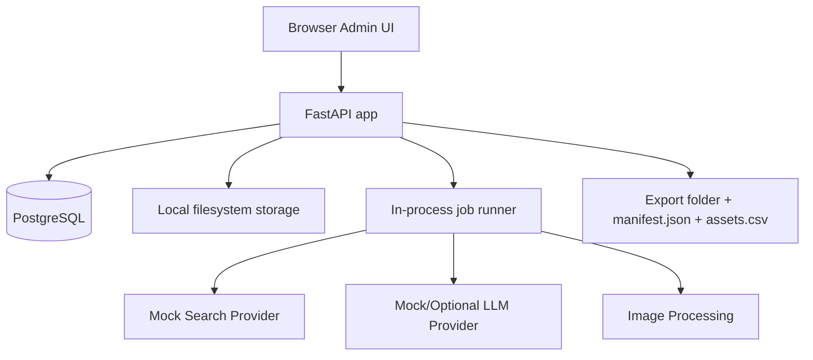
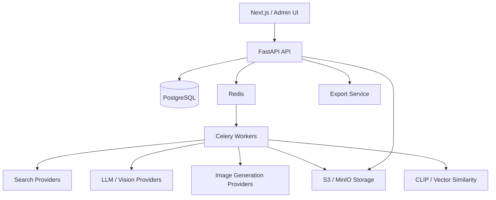

# ТЗ для Codex: финальный облегчённый MVP пайплайна подбора иллюстраций для видео про ошибки в дизайне кухни

Версия: `0.3-final-mvp`  
Язык интерфейса: русский  
Основной сценарий: видео формата «говорящая голова», где ведущий рассказывает об ошибках в дизайне интерьера кухни. Нужно подобрать или подготовить иллюстрации для каждой ошибки в формате «неправильно / правильно», дать пользователю удобную админку для отбора и автоматически разложить утверждённые ассеты для монтажа.

Этот документ заменяет более тяжёлую версию ТЗ и включает правки по итогам инженерного ревью MVP. В нём намеренно разделены:

1. **MVP-архитектура** — максимально простая версия, которую можно быстро реализовать и проверить на реальном процессе.
2. **Целевая архитектура после MVP** — направление развития, к которому система должна прийти, когда появятся реальные провайдеры, больше данных и более сложная автоматизация.

---

## 1. Ключевое архитектурное решение

Для MVP не строим enterprise-систему из множества сервисов. Стартуем с простого монолита:

```text
FastAPI app
  ├── JSON API
  ├── server-rendered admin UI
  ├── bounded in-process jobs
  ├── provider interfaces
  ├── local filesystem storage
  └── PostgreSQL
```

Не используем в MVP:

```text
Celery
Redis
MinIO / S3
Next.js
отдельный worker service
реальные image generation providers
CLIP embeddings
browser scraping
```

При этом проектируем код так, чтобы после MVP было легко перейти к более взрослой архитектуре:

```text
FastAPI API
  ↓
Celery / Redis workers
  ↓
S3 / MinIO storage
  ↓
real search providers
  ↓
LLM / Vision / Generation providers
  ↓
Next.js или другой полноценный admin frontend
```

### Почему так

MVP должен проверить главную ценность продукта:

```text
нейросеть / поиск помогают собрать варианты → человек быстро ревьюит карточки → система сама раскладывает ассеты для монтажа
```

На этом этапе не нужно масштабирование, отдельный фронтенд, брокер очередей и S3. Они добавят сложность, но не докажут продуктовую ценность.

Однако сразу нужны правильные архитектурные границы:

- provider interfaces для поиска, LLM, vision и генерации;
- job table с idempotency, чтобы потом заменить in-process jobs на Celery;
- bounded in-process job runner, чтобы не блокировать FastAPI event loop;
- storage keys вместо абсолютных путей;
- storage cleanup policy для синхронизации БД и локальных файлов;
- стабильная модель прав;
- пагинация;
- audit log;
- export manifest со schema version.

---

## 2. Цель MVP

Реализовать рабочий локальный прототип, в котором пользователь может:

1. Создать видео-проект.
2. Вручную добавить ошибки дизайна кухни или получить mock/LLM-помощь.
3. Для каждой ошибки задать:
   - что показать как `wrong`;
   - что показать как `right`;
   - что не брать.
4. Сгенерировать или вручную создать поисковые запросы.
5. Получить изображения через `mock` provider.
6. Увидеть картинки в карточной админке.
7. Нажимать:
   - `Подходит как финальный ассет`;
   - `Использовать как референс`;
   - `Не подходит`;
   - `Заблокировать домен`;
   - `Подтвердить права вручную`;
   - `Загрузить свой ассет`.
8. Не дать пользователю случайно утвердить картинку с неизвестными правами как финальный ассет.
9. Экспортировать утверждённые финальные ассеты в структуру папок, `manifest.json` и `assets.csv`.

Важно: в MVP основной путь — **ручное создание и редактирование карточек ошибок**. LLM может помогать, но не должен быть обязательной зависимостью. Если LLM отключён или возвращает некачественный результат, пользователь всё равно должен полностью пройти workflow вручную.

---

## 3. Главная продуктовая логика

Система не должна быть «автоматическим генератором картинок». Система должна быть ассистентом по подбору и подготовке визуальных материалов.

Базовый workflow:

```text
Видео / расшифровка / список ошибок
  ↓
Карточки ошибок wrong/right
  ↓
Поисковые запросы
  ↓
Кандидаты изображений
  ↓
Автофильтр по качеству, дублям, доменам и правам
  ↓
Карточное ревью пользователем
  ↓
Финальные ассеты или reference-only ассеты
  ↓
Обработка в 1920×1080
  ↓
Экспорт для монтажа
```

---

## 4. Политика авторских прав

### 4.1. Запрещённый сценарий

Нельзя реализовывать или поощрять такой workflow:

```text
Нашли чужую картинку в поиске
  ↓
Скачали
  ↓
Прогнали через image-to-image
  ↓
Получили похожую картинку
  ↓
Используем как «свободную»
```

Это не считается решением проблемы прав.

### 4.2. Разрешённый сценарий

Картинки из общего поиска с неизвестными правами можно использовать только как референс. `reference_only` не очищает права и не делает картинку пригодной для прямого использования; это технический статус, который запрещает случайный экспорт чужого изображения.

Разрешённый workflow:

```text
Нашли картинку
  ↓
Пользователь отметил: «хорошо показывает ошибку»
  ↓
Картинка получает статус reference_only
  ↓
Система формирует абстрактное текстовое ТЗ
  ↓
Финальный ассет создаётся отдельно:
    - из лицензированного источника;
    - как own_upload;
    - как own_render;
    - как AI text-only generation в будущем;
    - как ассет с явно подтверждёнными правами
```

### 4.3. Backend enforcement

Frontend может блокировать кнопки, но главное правило должно проверяться на backend:

```text
Если may_use_directly = false:
  approve_final запрещён
```

Исключение в MVP не называется `admin_override`. Вместо этого реализуется понятный flow:

```text
Подтвердить права вручную
```

Пользователь может вручную изменить rights status только через специальное действие, где должен указать комментарий:

```text
- где получена лицензия;
- почему ассет можно использовать;
- ссылка на источник или договор, если есть;
- произвольный комментарий.
```

После этого:

```text
rights_status = manual_licensed
may_use_directly = true
```

Это действие обязательно пишется в audit log.

---

## 5. MVP stack

Использовать:

```text
Language: Python 3.12+
Backend: FastAPI
Templates: Jinja2
UI interactions: HTMX или минимальный vanilla JS
ORM: SQLAlchemy 2.x
Migrations: Alembic
Database: PostgreSQL
Tests: pytest
Image processing: Pillow
Optional video/image tools: ffmpeg, если уже есть в окружении
Storage: локальная папка ./storage
Containerization: docker compose
```

Не использовать в MVP:

```text
Next.js
React app
Celery
Redis
MinIO
S3
Qdrant
pgvector
CLIP
real Yandex/Pexels/Unsplash integration
real image generation provider
```

Примечание: PostgreSQL оставляем даже в облегчённом MVP, потому что он пригодится после MVP и хорошо поддерживает `JSONB`, constraints, индексы, миграции и нормальную работу с данными. Для unit-тестов можно использовать отдельную test DB; SQLite поддерживать необязательно.

---

## 6. MVP architecture



### 6.1. Сервисы в docker compose

Для MVP достаточно:

```text
web   FastAPI app, API + admin UI + in-process jobs
db    PostgreSQL
```

Опционально:

```text
adminer / pgadmin для локальной отладки, если удобно
```

После запуска:

```text
Admin UI: http://localhost:8000/admin
API docs: http://localhost:8000/docs
```

---

## 7. Целевая архитектура после MVP

После MVP перейти к такой архитектуре:



### 7.1. Почему переходить именно туда

`Celery + Redis` нужны, когда появятся реальные долгие и ненадёжные задачи:

```text
- запросы к внешним поисковым API;
- скачивание сотен изображений;
- vision scoring;
- генерация картинок;
- retry/backoff/circuit breaker;
- массовый экспорт;
- обработка больших файлов.
```

`S3 / MinIO` нужны, когда локальная папка перестанет быть достаточной:

```text
- несколько инстансов приложения;
- много файлов;
- бэкапы;
- удалённый доступ;
- CDN;
- разграничение окружений.
```

`Next.js` или другой frontend нужен, когда админка станет сложной:

```text
- drag-and-drop pairing;
- live job progress;
- side-by-side visual comparison;
- сложная фильтрация;
- пакетное ревью;
- multi-user роли.
```

`CLIP / embeddings` нужны, когда pHash перестанет хватать:

```text
- поиск похожей композиции;
- группировка визуально близких кухонь;
- обучение ранжирования на действиях пользователя;
- проверка, что generated asset не слишком похож на reference.
```

---

## 8. Структура репозитория для MVP

```text
.
├── app/
│   ├── main.py
│   ├── config.py
│   ├── db.py
│   ├── models/
│   │   ├── __init__.py
│   │   ├── video.py
│   │   ├── mistake.py
│   │   ├── candidate.py
│   │   ├── asset.py
│   │   ├── job.py
│   │   └── audit.py
│   ├── schemas/
│   ├── routers/
│   │   ├── api.py
│   │   ├── admin.py
│   │   └── uploads.py
│   ├── services/
│   │   ├── rights.py
│   │   ├── scoring.py
│   │   ├── storage.py
│   │   ├── image_processing.py
│   │   ├── export.py
│   │   └── jobs.py
│   ├── commands/
│   │   ├── cleanup_storage.py
│   │   └── check_storage.py
│   ├── providers/
│   │   ├── search/
│   │   │   ├── base.py
│   │   │   └── mock.py
│   │   ├── llm/
│   │   │   ├── base.py
│   │   │   └── mock.py
│   │   └── generation/
│   │       ├── base.py
│   │       └── placeholder.py
│   ├── templates/
│   │   ├── base.html
│   │   ├── videos.html
│   │   ├── video_detail.html
│   │   ├── mistake_detail.html
│   │   └── partials/
│   ├── static/
│   └── prompts/
├── alembic/
├── fixtures/
│   └── mock_images.json
├── tests/
├── storage/              # gitignored
├── exports/              # gitignored
├── docker-compose.yml
├── Dockerfile
├── pyproject.toml
├── .env.example
└── README.md
```

---

## 9. Основные сущности

### 9.1. Video

Видео-проект.

```text
id
slug
title
transcript
status
deleted_at nullable
created_at
updated_at
```

Статусы:

```text
draft
review
ready_to_export
exported
archived
```

### 9.2. Mistake

Одна ошибка дизайна кухни.

```text
id
video_id
order_index
title
short_title
time_start
time_end
explanation
wrong_visual_prompt
right_visual_prompt
negative_criteria
created_at
updated_at
```

Пример:

```json
{
  "order_index": 1,
  "title": "Недостаточно сценариев освещения",
  "short_title": "Плохое освещение",
  "time_start": "00:01:23",
  "time_end": "00:01:48",
  "explanation": "Рабочая зона кухни оказывается в тени, потому что есть только общий потолочный свет.",
  "wrong_visual_prompt": "Кухня, где столешница под верхними шкафами находится в тени, нет LED-подсветки под шкафами, зона готовки плохо освещена.",
  "right_visual_prompt": "Кухня с отдельной подсветкой рабочей поверхности под верхними шкафами, столешница равномерно освещена, зона готовки хорошо видна.",
  "negative_criteria": [
    "не брать картинки без кухни",
    "не брать изображения с водяными знаками",
    "не брать красивые кухни, где ошибка визуально не считывается"
  ]
}
```

### 9.3. SearchQuery

Поисковый запрос для конкретной ошибки и стороны `wrong/right`.

```text
id
mistake_id
side                  wrong | right
source_provider       mock | yandex | pexels | unsplash | openverse
query_text
language              ru | en | unknown
status                pending | running | done | failed
results_count
error_message
created_at
updated_at
```

В MVP реальный provider только `mock`. Остальные значения нужны для будущих adapter stubs.

### 9.4. ImageCandidate

Найденная картинка-кандидат.

```text
id
mistake_id
query_id
side                         wrong | right
source_type                  mock | yandex | pexels | unsplash | openverse | stock | own_upload | ai_generated | own_render
source_provider
source_page_url
image_url
image_url_hash
thumbnail_url
original_width
original_height
domain
author_name
license_label
rights_status
usage_role                   candidate | reference_only
may_use_directly             boolean
storage_key_thumbnail
storage_key_original
storage_key_processed
phash
score_quality               technical score for final-asset suitability
score_visual                 nullable in MVP
reference_priority_score     nullable in MVP; future/manual value for reference usefulness
review_score                 default = score_quality in MVP
quality_flags                JSONB array: low_resolution, bad_aspect_ratio, missing_metadata, too_large
is_low_quality               boolean marker; not automatic rejection
storage_status               not_downloaded | ok | processing | missing_file | processing_failed
status                       discovered | review | approved_reference | approved_final | rejected | auto_rejected | failed_download
reject_reason
reviewed_by
reviewed_at
created_at
updated_at
```

### 9.5. ReferenceBrief

Абстрактное описание, полученное из reference-only картинки.

```text
id
candidate_id
mistake_id
side
visual_problem
important_visual_signs       JSONB array
do_not_copy                  JSONB array
clean_generation_brief
negative_prompt
status                       draft | approved | failed
created_at
updated_at
```

В MVP можно делать это через mock LLM или вручную. Реальная генерация изображения по brief — post-MVP.

### 9.6. FinalAsset

Финальный ассет, который может попасть в экспорт.

```text
id
video_id
mistake_id
side                         wrong | right
candidate_id                 nullable FK to image_candidates
source_type                  mock | own_upload | stock | ai_generated | own_render | manual_licensed
source_url
license_label
author_name
rights_status
may_use_directly             boolean
license_note                 required for manual_licensed
license_document_ref
rights_confirmed_by
rights_confirmed_at
storage_key_original
storage_key_thumbnail
storage_key_processed
metadata_storage_key          optional sidecar metadata JSON
storage_status               ok | missing_file | processing_failed | cleanup_pending
original_exif_preserved      boolean
processed_exif_stripped      boolean
caption
sort_order
status                       approved | exported | rejected
created_at
updated_at
```

Логика:

- если пользователь утверждает candidate с `may_use_directly=true`, создаётся `FinalAsset` с `candidate_id`;
- если пользователь загружает свой файл, создаётся `FinalAsset` без `candidate_id`;
- если пользователь вручную подтверждает права на candidate, нужно сохранить `license_note`, `license_document_ref`, `rights_confirmed_by`, `rights_confirmed_at`;
- если в будущем генерируется AI/3D ассет, он тоже может попадать в `FinalAsset` без polymorphic FK.

Это намеренно проще и безопаснее, чем polymorphic FK.

### 9.7. Job

Простая таблица задач для MVP.

```text
id
type
status                       pending | running | succeeded | failed | partially_failed | cancelled
idempotency_key              unique
payload                      JSONB
result                       JSONB
error_message
attempts
max_attempts
locked_by                    nullable, for in-process runner
locked_at                    nullable
created_at
started_at
finished_at
updated_at
```

Зачем job table в MVP:

- показывать пользователю статус;
- не терять результат задачи;
- защищаться от повторного запуска;
- позже заменить in-process runner на Celery без переписывания бизнес-логики.

### 9.8. BlockedDomain

```text
id
domain
reason
created_at
```

### 9.9. AuditEvent

```text
id
actor
entity_type
entity_id
action
before                     JSONB
after                      JSONB
comment
created_at
```

---

## 10. Минимальная схема БД

Использовать `BIGSERIAL` для primary key в MVP. Это проще для отладки, URL и логов.

Если позже нужна распределённая генерация ID, можно перейти на UUIDv7/ULID, но для MVP это не требуется.

Enum-like поля храним как `TEXT` и валидируем в приложении через Pydantic/SQLAlchemy. Это упрощает изменение статусов без болезненных миграций PostgreSQL enum.

```sql
CREATE TABLE videos (
  id BIGSERIAL PRIMARY KEY,
  slug TEXT UNIQUE NOT NULL,
  title TEXT NOT NULL,
  transcript TEXT,
  status TEXT NOT NULL DEFAULT 'draft',
  deleted_at TIMESTAMP,
  created_at TIMESTAMP NOT NULL DEFAULT now(),
  updated_at TIMESTAMP NOT NULL DEFAULT now()
);

CREATE TABLE mistakes (
  id BIGSERIAL PRIMARY KEY,
  video_id BIGINT NOT NULL REFERENCES videos(id) ON DELETE CASCADE,
  order_index INTEGER NOT NULL,
  title TEXT NOT NULL,
  short_title TEXT,
  time_start TEXT,
  time_end TEXT,
  explanation TEXT,
  wrong_visual_prompt TEXT,
  right_visual_prompt TEXT,
  negative_criteria JSONB NOT NULL DEFAULT '[]',
  created_at TIMESTAMP NOT NULL DEFAULT now(),
  updated_at TIMESTAMP NOT NULL DEFAULT now(),
  UNIQUE (video_id, order_index)
);

CREATE TABLE search_queries (
  id BIGSERIAL PRIMARY KEY,
  mistake_id BIGINT NOT NULL REFERENCES mistakes(id) ON DELETE CASCADE,
  side TEXT NOT NULL CHECK (side IN ('wrong', 'right')),
  source_provider TEXT NOT NULL DEFAULT 'mock',
  query_text TEXT NOT NULL,
  language TEXT NOT NULL DEFAULT 'unknown',
  status TEXT NOT NULL DEFAULT 'pending',
  results_count INTEGER NOT NULL DEFAULT 0,
  error_message TEXT,
  created_at TIMESTAMP NOT NULL DEFAULT now(),
  updated_at TIMESTAMP NOT NULL DEFAULT now()
);

CREATE TABLE image_candidates (
  id BIGSERIAL PRIMARY KEY,
  mistake_id BIGINT NOT NULL REFERENCES mistakes(id) ON DELETE CASCADE,
  query_id BIGINT REFERENCES search_queries(id) ON DELETE SET NULL,
  side TEXT NOT NULL CHECK (side IN ('wrong', 'right')),
  source_type TEXT NOT NULL DEFAULT 'mock',
  source_provider TEXT,
  source_page_url TEXT,
  image_url TEXT,
  image_url_hash TEXT,
  thumbnail_url TEXT,
  original_width INTEGER,
  original_height INTEGER,
  domain TEXT,
  author_name TEXT,
  license_label TEXT,
  rights_status TEXT NOT NULL DEFAULT 'unknown',
  usage_role TEXT NOT NULL DEFAULT 'candidate',
  may_use_directly BOOLEAN NOT NULL DEFAULT false,
  storage_key_thumbnail TEXT,
  storage_key_original TEXT,
  storage_key_processed TEXT,
  phash TEXT,
  score_quality NUMERIC,
  score_visual NUMERIC,
  reference_priority_score NUMERIC,
  review_score NUMERIC,
  quality_flags JSONB NOT NULL DEFAULT '[]',
  is_low_quality BOOLEAN NOT NULL DEFAULT false,
  storage_status TEXT NOT NULL DEFAULT 'not_downloaded',
  status TEXT NOT NULL DEFAULT 'discovered',
  reject_reason TEXT,
  reviewed_by TEXT,
  reviewed_at TIMESTAMP,
  created_at TIMESTAMP NOT NULL DEFAULT now(),
  updated_at TIMESTAMP NOT NULL DEFAULT now(),
  UNIQUE (mistake_id, side, image_url_hash)
);

CREATE TABLE reference_briefs (
  id BIGSERIAL PRIMARY KEY,
  candidate_id BIGINT NOT NULL REFERENCES image_candidates(id) ON DELETE CASCADE,
  mistake_id BIGINT NOT NULL REFERENCES mistakes(id) ON DELETE CASCADE,
  side TEXT NOT NULL CHECK (side IN ('wrong', 'right')),
  visual_problem TEXT,
  important_visual_signs JSONB NOT NULL DEFAULT '[]',
  do_not_copy JSONB NOT NULL DEFAULT '[]',
  clean_generation_brief TEXT,
  negative_prompt TEXT,
  status TEXT NOT NULL DEFAULT 'draft',
  created_at TIMESTAMP NOT NULL DEFAULT now(),
  updated_at TIMESTAMP NOT NULL DEFAULT now(),
  UNIQUE (candidate_id)
);

CREATE TABLE final_assets (
  id BIGSERIAL PRIMARY KEY,
  video_id BIGINT NOT NULL REFERENCES videos(id) ON DELETE CASCADE,
  mistake_id BIGINT NOT NULL REFERENCES mistakes(id) ON DELETE CASCADE,
  side TEXT NOT NULL CHECK (side IN ('wrong', 'right')),
  candidate_id BIGINT REFERENCES image_candidates(id) ON DELETE SET NULL,
  source_type TEXT NOT NULL,
  source_url TEXT,
  license_label TEXT,
  author_name TEXT,
  rights_status TEXT NOT NULL,
  may_use_directly BOOLEAN NOT NULL DEFAULT false,
  license_note TEXT,
  license_document_ref TEXT,
  rights_confirmed_by TEXT,
  rights_confirmed_at TIMESTAMP,
  storage_key_original TEXT,
  storage_key_thumbnail TEXT,
  storage_key_processed TEXT,
  metadata_storage_key TEXT,
  storage_status TEXT NOT NULL DEFAULT 'ok',
  original_exif_preserved BOOLEAN NOT NULL DEFAULT true,
  processed_exif_stripped BOOLEAN NOT NULL DEFAULT true,
  caption TEXT,
  sort_order INTEGER NOT NULL DEFAULT 0,
  status TEXT NOT NULL DEFAULT 'approved',
  created_at TIMESTAMP NOT NULL DEFAULT now(),
  updated_at TIMESTAMP NOT NULL DEFAULT now()
);

CREATE TABLE jobs (
  id BIGSERIAL PRIMARY KEY,
  type TEXT NOT NULL,
  status TEXT NOT NULL DEFAULT 'pending',
  idempotency_key TEXT UNIQUE NOT NULL,
  payload JSONB NOT NULL DEFAULT '{}',
  result JSONB NOT NULL DEFAULT '{}',
  error_message TEXT,
  attempts INTEGER NOT NULL DEFAULT 0,
  max_attempts INTEGER NOT NULL DEFAULT 3,
  locked_by TEXT,
  locked_at TIMESTAMP,
  created_at TIMESTAMP NOT NULL DEFAULT now(),
  started_at TIMESTAMP,
  finished_at TIMESTAMP,
  updated_at TIMESTAMP NOT NULL DEFAULT now()
);

CREATE TABLE blocked_domains (
  id BIGSERIAL PRIMARY KEY,
  domain TEXT UNIQUE NOT NULL,
  reason TEXT,
  created_at TIMESTAMP NOT NULL DEFAULT now()
);

CREATE TABLE audit_events (
  id BIGSERIAL PRIMARY KEY,
  actor TEXT NOT NULL DEFAULT 'local_admin',
  entity_type TEXT NOT NULL,
  entity_id TEXT NOT NULL,
  action TEXT NOT NULL,
  before JSONB,
  after JSONB,
  comment TEXT,
  created_at TIMESTAMP NOT NULL DEFAULT now()
);
```

Дополнительные индексы:

```sql
CREATE INDEX idx_videos_deleted_at ON videos(deleted_at);
CREATE INDEX idx_mistakes_video_id ON mistakes(video_id);
CREATE INDEX idx_candidates_mistake_side_status ON image_candidates(mistake_id, side, status);
CREATE INDEX idx_candidates_review_score ON image_candidates(review_score DESC);
CREATE INDEX idx_candidates_storage_status ON image_candidates(storage_status);
CREATE INDEX idx_final_assets_video_mistake ON final_assets(video_id, mistake_id);
CREATE INDEX idx_final_assets_storage_status ON final_assets(storage_status);
CREATE INDEX idx_jobs_status ON jobs(status);
CREATE INDEX idx_jobs_locked_at ON jobs(locked_at);
```

---

## 11. Storage layout

Внутренние пути не должны зависеть от `order_index` или `slug`, потому что пользователь может переименовать ошибку или поменять порядок.

### 11.1. Internal storage

```text
storage/
  projects/
    {video_id}/
      candidates/
        {candidate_id}/
          original.jpg
          thumb.jpg
          processed_1920x1080.jpg
      final_assets/
        {asset_id}/
          original.jpg
          thumb.jpg
          processed_1920x1080.jpg
          metadata.json          optional sidecar для прав и provenance
      references/
        {candidate_id}/
          thumb.jpg
      uploads/
        {upload_id}/
          original.jpg
```

В БД хранить только относительный `storage_key`, например:

```text
projects/12/candidates/358/thumb.jpg
```

Не хранить абсолютные пути типа `/Users/...` или `/mnt/...`.

Оригинальные файлы считаются immutable:

```text
original.jpg не перезаписывать
original.jpg сохранять как есть
EXIF оригинала не чистить
processed/thumbnail можно пересоздавать
```

### 11.2. Export storage

Human-readable структура создаётся только во время экспорта:

```text
exports/
  kitchen-design-mistakes-01_2026-06-05_120000/
    manifest.json
    assets.csv
    mistakes/
      01_bad-lighting/
        wrong/
          001_1920x1080.jpg
          001_metadata.json        optional для manual_licensed
        right/
          001_1920x1080.jpg
      02_bad-storage/
        wrong/
        right/
```

Если пользователь переименовал ошибку, старый internal storage не меняется. Новый export создаётся заново.

### 11.3. Storage consistency and cleanup

БД является source of truth. Файлы без записей в БД считаются orphan files. Записи в БД со ссылкой на отсутствующий файл считаются broken assets.

Правила MVP:

```text
- Не удалять большие папки синхронно внутри HTTP request.
- DELETE /api/videos/{video_id} должен сначала создать cleanup_storage job со storage prefix, а затем выполнить soft delete или удалить записи БД.
- DELETE /api/final-assets/{asset_id} должен удалить/пометить запись и создать cleanup_storage job для папки ассета.
- Если cleanup job упала, UI должен показывать warning, но данные БД не должны возвращаться в старое состояние.
- processed/thumbnail файлы являются derived files и могут быть пересозданы.
- если запись в БД есть, но файла нет, показывать broken/missing file warning в UI;
- если файл есть, но записи в БД нет, считать его orphan file.
```

Добавить management command:

```bash
python -m app.commands.cleanup_storage --dry-run
python -m app.commands.cleanup_storage --delete
```

`--dry-run` должен показать:

```text
- orphan files;
- missing files for DB records;
- общий размер потенциального удаления;
- список affected video_id / asset_id / candidate_id.
```

Для MVP достаточно простого garbage collector. Post-MVP storage cleanup переедет в отдельные worker jobs.

### 11.4. Sidecar metadata

Для юридически значимых сведений не полагаться только на EXIF.

Для final assets можно создавать sidecar metadata:

```text
projects/{video_id}/final_assets/{asset_id}/metadata.json
```

Пример:

```json
{
  "asset_id": 123,
  "source_type": "manual_licensed",
  "rights_status": "manual_licensed",
  "source_url": "https://example.com/source",
  "license_note": "Куплено на стоке / получено разрешение / собственный файл",
  "license_document_ref": "optional invoice/license/local note reference",
  "author_name": "...",
  "original_exif_preserved": true,
  "processed_exif_stripped": true
}
```

---

## 12. Manifest schema

Каждый export должен содержать `schema_version`.

```json
{
  "schema_version": "1.0",
  "exported_at": "2026-06-05T12:00:00Z",
  "video": {
    "id": 1,
    "slug": "kitchen-design-mistakes-01",
    "title": "7 ошибок в дизайне кухни"
  },
  "mistakes": [
    {
      "id": 10,
      "order_index": 1,
      "title": "Недостаточно сценариев освещения",
      "time_start": "00:01:23",
      "time_end": "00:01:48",
      "wrong_assets": [
        {
          "id": 101,
          "file": "mistakes/01_bad-lighting/wrong/001_1920x1080.jpg",
          "source_type": "own_upload",
          "rights_status": "own",
          "source_url": null,
          "license_note": null,
          "license_document_ref": null,
          "author_name": null,
          "original_exif_preserved": true,
          "processed_exif_stripped": true
        }
      ],
      "right_assets": [
        {
          "id": 102,
          "file": "mistakes/01_bad-lighting/right/001_1920x1080.jpg",
          "source_type": "manual_licensed",
          "rights_status": "manual_licensed",
          "source_url": "https://example.com/source",
          "license_note": "Права подтверждены вручную пользователем",
          "license_document_ref": "optional local note or external reference",
          "author_name": "optional author name",
          "original_exif_preserved": true,
          "processed_exif_stripped": true
        }
      ]
    }
  ]
}
```

Также создавать `assets.csv`:

```csv
schema_version,video_id,mistake_id,order_index,side,asset_id,file,time_start,time_end,title,source_type,rights_status,source_url,license_note,license_document_ref,author_name,original_exif_preserved,processed_exif_stripped
```

---

## 13. API для MVP

Даже если UI server-rendered, JSON API нужен для HTMX/JS и будущего frontend.

### 13.1. Videos

```http
POST /api/videos
GET /api/videos?limit=50&offset=0&status=draft
GET /api/videos/{video_id}
PATCH /api/videos/{video_id}
DELETE /api/videos/{video_id}
```

`DELETE /api/videos/{video_id}` должен удалить записи из БД и создать `cleanup_storage` job или сразу пометить файлы на очистку. Физическое удаление больших папок не делать внутри HTTP request.

`POST /api/videos`:

```json
{
  "title": "7 ошибок в дизайне кухни",
  "slug": "kitchen-design-mistakes-01",
  "transcript": "..."
}
```

### 13.2. Mistakes

```http
GET /api/videos/{video_id}/mistakes?limit=100&offset=0
POST /api/videos/{video_id}/mistakes
GET /api/mistakes/{mistake_id}
PATCH /api/mistakes/{mistake_id}
DELETE /api/mistakes/{mistake_id}
POST /api/videos/{video_id}/extract-mistakes
```

В MVP ручное создание ошибок должно быть основным надёжным способом. `extract-mistakes` может работать через mock LLM или optional LLM provider.

### 13.3. Search queries

```http
POST /api/mistakes/{mistake_id}/generate-search-queries
GET /api/mistakes/{mistake_id}/search-queries?side=wrong&limit=100&offset=0
POST /api/mistakes/{mistake_id}/search
```

`POST /api/mistakes/{mistake_id}/search`:

```json
{
  "sides": ["wrong", "right"],
  "providers": ["mock"],
  "limit_per_query": 20
}
```

Ответ:

```json
{
  "job_id": 123,
  "status": "pending"
}
```

### 13.4. Candidates

```http
GET /api/mistakes/{mistake_id}/candidates?side=wrong&status=review&limit=50&offset=0&sort=-review_score
GET /api/candidates/{candidate_id}
POST /api/candidates/{candidate_id}/review
POST /api/candidates/{candidate_id}/use-as-reference
POST /api/candidates/{candidate_id}/confirm-rights
POST /api/candidates/{candidate_id}/block-domain
```

`POST /api/candidates/{candidate_id}/review`:

```json
{
  "action": "approve_final | approve_reference | reject",
  "reject_reason": "not_kitchen | wrong_error | watermark | bad_quality | bad_style | no_rights | duplicate | text_overlay | other",
  "comment": "optional"
}
```

Правило:

```text
Если action = approve_final и may_use_directly = false:
  вернуть 403 с понятным сообщением.
```

`POST /api/candidates/{candidate_id}/confirm-rights`:

```json
{
  "rights_status": "manual_licensed",
  "source_url": "https://example.com/license-or-source-page",
  "license_note": "Картинка куплена/получено разрешение/используется по лицензии ...",
  "license_document_ref": "optional invoice/license/local note reference",
  "author_name": "optional author name",
  "comment": "Почему пользователь подтверждает права; пишется в audit log"
}
```

Backend должен требовать непустой `comment`. Этот комментарий сохраняется как `license_note` у ассета и как `comment` в `audit_events`. Нельзя полагаться только на EXIF или внешнюю страницу как доказательство прав.

`POST /api/candidates/{candidate_id}/use-as-reference` может принимать:

```json
{
  "mark_high_value": true,
  "comment": "Хорошо показывает ошибку, но не подходит как финальный ассет"
}
```

Если `mark_high_value=true`:

```text
usage_role = reference_only
status = approved_reference
reference_priority_score = 1.0
```

### 13.5. Uploads / final assets

```http
POST /api/mistakes/{mistake_id}/upload-final-asset
GET /api/videos/{video_id}/final-assets?limit=100&offset=0
DELETE /api/final-assets/{asset_id}
```

Upload должен принимать:

```text
file
side
rights_status
source_url optional
license_note optional
license_document_ref optional
author_name optional
comment required unless rights_status = own
```

### 13.6. Jobs

```http
GET /api/jobs/{job_id}
GET /api/jobs?status=running&limit=50&offset=0
POST /api/storage/cleanup-dry-run
POST /api/storage/cleanup
```

### 13.7. Storage health / cleanup

Для MVP достаточно CLI-команд, но storage service должен поддерживать будущую диагностику. Если добавить endpoints, они должны быть admin-only:

```http
GET /api/storage/health
POST /api/storage/cleanup?dry_run=true
```

`dry_run=true` не удаляет файлы, а только возвращает orphan/missing report.

### 13.8. Export

```http
POST /api/videos/{video_id}/export
GET /api/videos/{video_id}/manifest
GET /api/videos/{video_id}/assets-csv
```

`POST /api/videos/{video_id}/export` возвращает `job_id` или сразу результат, если export выполняется синхронно.

---

## 14. Admin UI для MVP

Использовать Jinja2 + HTMX или минимальный vanilla JS. Не нужен Next.js.

### 14.1. Страницы

```text
/admin
/admin/videos
/admin/videos/{video_id}
/admin/videos/{video_id}/mistakes/{mistake_id}
/admin/jobs
```

### 14.2. Список видео

Показать:

```text
Название
Slug
Статус
Количество ошибок
Количество final assets
Дата создания
Кнопки: открыть, экспортировать, удалить
```

### 14.3. Страница видео

Показать:

```text
Название
Transcript
Список ошибок
Кнопки:
  - Добавить ошибку вручную     # primary MVP flow
  - Извлечь ошибки mock/LLM      # optional helper, never blocking
  - Сгенерировать запросы
  - Запустить mock search
  - Экспортировать
```

Для каждой ошибки:

```text
[01] Нет сценариев освещения
wrong final: 1 | right final: 0 | references: 2 | candidates: 24
```

### 14.4. Страница ошибки

Сверху:

```text
Ошибка: Мало мест хранения
Таймкод: 00:03:12–00:03:48
Wrong visual prompt: ...
Right visual prompt: ...
Negative criteria: ...
```

Дальше две колонки:

```text
НЕПРАВИЛЬНО                         ПРАВИЛЬНО
[карточки wrong]                    [карточки right]
```

Фильтры:

```text
side: wrong/right/all
status: review/approved_reference/approved_final/rejected/auto_rejected
source_provider
rights_status
sort: review_score/resolution/created_at
limit/offset или load more
```

### 14.5. Карточка candidate

Показывать:

```text
thumbnail
status
review_score
quality_score
reference_priority_score, если есть
storage_status
source_provider
source_type
resolution
license_label
rights_status
may_use_directly
domain
query_text
source link
```

Кнопки:

```text
Подходит как финальный ассет
Использовать как референс
Хороший референс, несмотря на качество
Подтвердить права вручную
Не подходит
Заблокировать домен
Открыть источник
```

Если `may_use_directly=false`, кнопка `Подходит как финальный ассет` disabled.

Tooltip:

```text
У изображения неизвестные права. Его можно использовать только как референс или сначала подтвердить права вручную.
```

---

## 15. Job runner в MVP

Не использовать Celery/Redis. Но сразу реализовать job abstraction.

### 15.1. Правило создания job

Каждая потенциально повторяемая задача должна иметь `idempotency_key`.

Примеры:

```text
search:{mistake_id}:{side}:{provider}:{query_hash}
generate_queries:{mistake_id}:{prompt_version}
extract_mistakes:{video_id}:{transcript_hash}:{prompt_version}
export:{video_id}:{export_version}:{approved_assets_hash}
reference_brief:{candidate_id}:{prompt_version}
process_final_asset:{asset_id}:{source_hash}:{target_size}
cleanup_storage:{storage_prefix}:{reason_hash}
```

Если job с таким ключом уже есть в статусе `pending`, `running` или `succeeded`, повторно не создавать задачу, а вернуть существующий `job_id`.

### 15.2. In-process execution

В MVP допустимо:

```text
FastAPI BackgroundTasks
или простой in-process runner
или синхронный запуск в DEV_SYNC_JOBS=true
```

Важно: бизнес-логика задач должна быть вынесена в сервисы, чтобы позже Celery мог вызвать те же функции.

### 15.3. Bounded execution and event-loop safety

В MVP нельзя выполнять тяжёлые операции прямо внутри async request handler.

Правила:

```text
- не запускать Pillow/ffmpeg/download/export напрямую внутри async endpoint;
- job handlers для image processing писать как sync-функции или явно offload-ить в thread pool;
- если используется asyncio, блокирующий код выносить через asyncio.to_thread / bounded ThreadPoolExecutor;
- ограничить параллелизм image processing jobs;
- сохранять job.status в БД до начала и после завершения работы;
- при ошибке не оставлять candidate/final_asset в состоянии approved без processed file;
- HTTP request должен быстро вернуть job_id, а не ждать длинной обработки.
```

Рекомендуемые MVP-лимиты:

```text
MAX_RUNNING_JOBS = 5
MAX_IMAGE_PROCESSING_JOBS = 2
MAX_UPLOAD_MB = 20
MAX_DOWNLOAD_MB = 20
MAX_IMAGE_PIXELS = 25_000_000
```

Если изображение слишком большое:

```text
job.status = failed
error_message = "Image exceeds MAX_IMAGE_PIXELS"
storage_status = failed
```

Post-MVP эти правила сохраняются, но executor заменяется на Celery/Redis и отдельные worker containers.

### 15.4. Минимальные job types

```text
extract_mistakes
create_search_queries
run_search
score_candidates
create_reference_brief
download_candidate
process_final_asset
cleanup_storage
export_video
```

### 15.5. Retry policy в MVP

Даже для mock provider добавить общую политику:

```text
max_attempts = 3
timeout_seconds = 15 для provider calls
backoff = 1s, 3s, 10s
```

Если задача упала:

```text
status = failed
error_message = readable message
attempts incremented
```

Для `run_search` частичный сбой provider не должен ломать всё:

```text
provider mock: succeeded
provider yandex: disabled
provider pexels: failed
job status: partially_failed
```

В UI показывать частичный результат.

---

## 16. Providers

### 16.1. Search provider interface

```python
class ImageSearchProvider:
    name: str

    async def search(
        self,
        query: str,
        *,
        limit: int,
        side: str,
        filters: dict,
    ) -> list[ImageSearchResult]:
        ...

    async def find_similar(
        self,
        image_url_or_path: str,
        *,
        limit: int,
        filters: dict,
    ) -> list[ImageSearchResult]:
        ...
```

```python
class ImageSearchResult(BaseModel):
    source_provider: str
    source_type: str
    source_page_url: str | None
    image_url: str
    thumbnail_url: str | None
    width: int | None
    height: int | None
    domain: str | None
    author_name: str | None
    license_label: str | None
    rights_status: str
    may_use_directly: bool
```

### 16.2. MVP provider

Обязательно реализовать только:

```text
MockImageSearchProvider
```

Он читает `fixtures/mock_images.json`, фильтрует по `query_contains`, `side`, возвращает разные типы прав.

Fixture должен содержать как минимум:

```text
- несколько unknown rights candidates;
- несколько may_use_directly=true candidates;
- разные разрешения;
- разные aspect ratios;
- повторяющиеся URL для проверки дедупликации;
- домены для проверки block domain.
```

Пример:

```json
[
  {
    "query_contains": "освещение",
    "side": "wrong",
    "image_url": "https://example.com/mock/bad-lighting.jpg",
    "thumbnail_url": "https://example.com/mock/bad-lighting-thumb.jpg",
    "source_type": "mock",
    "source_provider": "mock",
    "source_page_url": "https://example.com/mock-page",
    "width": 1920,
    "height": 1080,
    "domain": "example.com",
    "license_label": "mock_unknown",
    "rights_status": "unknown",
    "may_use_directly": false
  }
]
```

### 16.3. Post-MVP providers

Создать adapter stubs, но не реализовывать реальные вызовы в MVP:

```text
YandexSearchProvider
PexelsProvider
UnsplashProvider
OpenverseProvider
```

Каждый provider должен поддерживать:

```text
is_enabled
credentials validation
timeout
retry/backoff
clear error messages
provider status in UI
```

Не реализовывать browser scraping.

---

## 17. LLM / graceful degradation

В MVP LLM не должен быть обязательным.

### 17.1. Основной путь

Основной путь MVP:

```text
пользователь вручную создаёт ошибки и visual prompts
```

UI должен поддерживать ручной workflow без LLM:

```text
- создать ошибку вручную;
- отредактировать title/short_title/timecodes;
- отредактировать wrong_visual_prompt;
- отредактировать right_visual_prompt;
- отредактировать negative_criteria;
- разбить одну ошибку на две;
- удалить ошибку;
- поменять order_index.
```

### 17.2. Optional helper

Дополнительно можно сделать:

```text
MockLLMProvider
```

или adapter interface для реального LLM.

LLM задачи:

```text
extract_mistakes
generate_search_queries
reference_to_clean_brief
```

LLM output всегда считается draft. Пользователь должен иметь возможность исправить результат до запуска поиска.

### 17.3. JSON validation

Если LLM включён, все ответы валидировать через Pydantic schema.

Если ответ невалидный:

```text
1. сохранить raw_response;
2. сделать 1 retry с просьбой вернуть строгий JSON;
3. если снова ошибка — показать в UI;
4. дать пользователю исправить вручную.
```

Если LLM вернул слишком общие или дублирующиеся ошибки:

```text
- не блокировать workflow;
- показать draft пользователю;
- дать удалить/объединить/разбить/переписать карточки.
```

### 17.4. Caching

Для LLM results хранить:

```text
prompt_version
model_name
input_hash
raw_response
parsed_response
```

В MVP можно хранить это в `jobs.result` или добавить отдельную таблицу позже.

---

## 18. Scoring в MVP

Не делать вид, что у нас есть полноценная visual relevance оценка, если vision provider отсутствует.

В MVP различать три смысла оценки:

```text
score_quality / technical_score
  Насколько картинка пригодна как финальный файл для монтажа.

score_visual
  Насколько картинка визуально соответствует ошибке. В MVP = null.

reference_priority_score
  Насколько картинка полезна как референс идеи. В MVP = null или manual flag.
```

### 18.1. MVP scores

В MVP считать только metadata/quality score:

```text
score_quality =
  0.50 * resolution_score
+ 0.35 * aspect_ratio_score
+ 0.15 * source_metadata_score
```

```text
score_visual = null
reference_priority_score = null by default
review_score = score_quality
```

Права не включать как обычный score. Права — это gate:

```text
may_use_directly=false → нельзя approve_final
```

Почему так: картинка с неизвестными правами может быть отличным референсом. Если смешать права с релевантностью, хорошие reference candidates будут искусственно занижены.

### 18.2. Reference value в MVP

Низкое техническое качество не должно автоматически уничтожать ценность референса.

Пример:

```text
картинка 800px, не 16:9, но идеально показывает узкий проход или плохое освещение
```

Она плохая как final asset, но может быть полезной как `reference_only`.

Поэтому в UI должно быть действие:

```text
Хороший референс, несмотря на качество
```

В MVP это может просто выставлять:

```text
usage_role = reference_only
status = approved_reference
reference_priority_score = 1.0
```

### 18.3. Resolution score

```text
1.0 если width >= 1920 и height >= 1080
0.8 если width >= 1280 и height >= 720
0.5 если width >= 800 и height >= 500
0.1 иначе
```

### 18.4. Aspect ratio score

```text
ratio = width / height
ideal = 16 / 9
score = max(0, 1 - abs(ratio - ideal) / ideal)
```

### 18.5. Source metadata score

```text
1.0 если есть source_page_url, image_url, domain, width, height
0.7 если отсутствует часть metadata, но есть image_url и размеры
0.4 если есть только image_url
0.0 если нет image_url
```

### 18.6. Auto reject в MVP

Не делать агрессивный автоотсев. Лучше показать пользователю больше карточек, чем случайно удалить хороший reference candidate.

Auto reject только для очевидных случаев:

```text
blocked domain
empty image_url
unsupported file type after download
clear duplicate by image_url_hash
```

Не auto reject, а помечать как `low_quality` / низкий `score_quality`:

```text
width < 500 или height < 300
неидеальный aspect ratio
маленький thumbnail
неполная metadata
```

Такие кандидаты должны оставаться доступными через фильтр, чтобы пользователь мог отметить их как reference-only.

---

## 19. Deduplication и similarity

### 19.1. MVP

В MVP:

```text
- image_url_hash для точных дублей;
- pHash для near-duplicates, если файл скачан;
- ручной review для похожести на reference.
```

pHash считать только технической проверкой. Он не является юридической гарантией и плохо ловит «похожую композицию в других цветах».

### 19.2. Post-MVP

Позже добавить:

```text
- CLIP image embeddings;
- группировку похожих изображений;
- comparison view side-by-side;
- reverse image search;
- similarity threshold для generated assets;
- ручное подтверждение «не слишком похоже на референс».
```

---

## 20. Image processing

Для каждого final asset создавать:

```text
original        сохранить без изменений
thumbnail       max 400px по длинной стороне
processed       1920×1080 JPG, пригодно для монтажа
```

### 20.1. Original files

Правила для `original`:

```text
- сохранять исходный файл как есть;
- не удалять EXIF;
- не перезаписывать;
- считать original юридически и технически важным исходником;
- хранить original_exif_preserved = true, если EXIF не трогали.
```

### 20.2. Processed files

Правила для `processed_1920x1080.jpg`:

```text
1. Целевой формат: 16:9.
2. Если исходник горизонтальный и достаточно широкий — center crop / safe crop.
3. Если исходник вертикальный — 16:9 canvas:
   - фон: размытие исходника на весь кадр;
   - поверх: исходник целиком по центру.
4. Не добавлять текст, логотипы или рамки по умолчанию.
5. EXIF у processed-файла удалять по умолчанию.
6. Хранить processed_exif_stripped = true, если metadata была удалена.
```

### 20.3. Rights metadata не хранить только в EXIF

Иногда EXIF может содержать автора или copyright, поэтому original сохраняется без изменений.

Но юридически важная информация должна храниться не только в EXIF, а в БД и экспорте:

```text
rights_status
source_url
license_note
license_document_ref
author_name
rights confirmation audit event
```

Для `manual_licensed` обязательно сохранять комментарий пользователя и source/license reference, если он есть.

Опционально можно создавать sidecar metadata:

```text
projects/{video_id}/final_assets/{asset_id}/metadata.json
```

Пример:

```json
{
  "asset_id": 123,
  "rights_status": "manual_licensed",
  "source_url": "https://example.com/source",
  "license_note": "Куплено/разрешено/подтверждено пользователем",
  "license_document_ref": "optional invoice/license/local note reference",
  "author_name": "optional",
  "original_exif_preserved": true,
  "processed_exif_stripped": true
}
```

### 20.4. Image safety limits

Перед обработкой проверять:

```text
file size <= MAX_UPLOAD_MB / MAX_DOWNLOAD_MB
image pixels <= MAX_IMAGE_PIXELS
file type supported
image can be decoded by Pillow
```

Если проверка не пройдена:

```text
job.status = failed
storage_status = failed
error_message = readable message
```

---

## 21. Export rules

Экспортировать только `FinalAsset`, у которых:

```text
status in ['approved', 'exported']
may_use_directly = true
storage_key_processed exists
```

Не экспортировать:

```text
reference_only candidates
unknown rights candidates
rejected candidates
failed_download candidates
auto_rejected candidates
```

Перед экспортом проверять:

```text
- у каждой ошибки есть хотя бы один wrong или right final asset;
- если чего-то нет, показать warning, но не обязательно блокировать export;
- manifest содержит schema_version;
- assets.csv создан;
- файлы физически существуют;
- rights metadata включены в manifest/assets.csv;
- original EXIF сохранён в original-файле, а processed-файл может быть очищен от EXIF.
```

---

## 22. Rate limiting и защита от повторных запусков

### 22.1. Backend idempotency

Кнопки в UI не должны создавать дубли, даже если пользователь нажал много раз.

Backend должен защищаться через:

```text
- idempotency_key в jobs;
- unique constraints в БД;
- image_url_hash;
- блокировку кнопки в UI только как дополнительную меру.
```

### 22.2. Простое rate limiting для MVP

Добавить application-level ограничения:

```text
- не более 1 active search job на mistake/side/provider;
- не более 5 running jobs одновременно;
- не более 2 image processing jobs одновременно;
- limit_per_query не больше 50;
- upload file size limit, например 20 MB;
- download file size limit, например 20 MB;
- image pixel limit, например 25_000_000 pixels.
```

Post-MVP можно добавить полноценный API rate limiting.

---

## 23. Error handling внешних провайдеров

В MVP реальный внешний provider не обязателен, но интерфейс ошибок должен быть заложен сразу.

Для provider calls:

```text
timeout_seconds = 15
max_attempts = 3
backoff = 1s, 3s, 10s + jitter
```

Ошибки делить на:

```text
credentials_missing
rate_limited
timeout
provider_unavailable
invalid_response
unknown_error
```

UI должен показывать:

```text
Mock: success, 20 results
Yandex: disabled, credentials missing
Pexels: failed, timeout
Openverse: skipped
```

Если часть providers упала, job получает:

```text
status = partially_failed
```

и пользователь всё равно видит успешные результаты.

Post-MVP добавить circuit breaker:

```text
если provider упал N раз подряд, временно отключить на cooldown_seconds
```

---

## 24. Admin actions и audit

Audit events писать минимум для:

```text
video.created
mistake.created
mistake.updated
candidate.approved_final
candidate.approved_reference
candidate.rejected
candidate.rights_confirmed
candidate.domain_blocked
final_asset.uploaded
final_asset.deleted
storage.cleanup_started
storage.cleanup_finished
storage.missing_file_detected
video.exported
job.failed
```

Для `rights_confirmed` обязательно сохранять:

```text
before.rights_status
before.may_use_directly
after.rights_status
after.may_use_directly
comment
source_url
license_note
license_document_ref
actor
created_at
```

---

## 25. Prompt templates

Хранить prompts в отдельных файлах, даже если в MVP они используются только mock/optional:

```text
app/prompts/
  extract_mistakes.ru.md
  generate_search_queries.ru.md
  reference_to_clean_brief.ru.md
```

### 25.1. `extract_mistakes.ru.md`

```text
Ты анализируешь расшифровку видео про ошибки в дизайне интерьера кухни.
Нужно выделить отдельные ошибки, которые можно проиллюстрировать изображениями.

Для каждой ошибки верни:
- order_index
- title
- short_title
- time_start, если есть
- time_end, если есть
- explanation
- wrong_visual_prompt
- right_visual_prompt
- negative_criteria

Важно:
- не придумывай ошибки, которых нет в тексте;
- формулируй визуальные признаки конкретно;
- не пиши общие фразы вроде «плохой дизайн»;
- возвращай только валидный JSON по схеме.
```

### 25.2. `generate_search_queries.ru.md`

```text
Для ошибки дизайна кухни нужно подготовить поисковые запросы для картинок.

Ошибка:
{{mistake_title}}

Что показать wrong:
{{wrong_visual_prompt}}

Что показать right:
{{right_visual_prompt}}

Сгенерируй:
- 5 запросов на русском для wrong;
- 5 запросов на английском для wrong;
- 5 запросов на русском для right;
- 5 запросов на английском для right.

Запросы должны быть конкретными и визуальными.
Не используй слишком общие запросы вроде «красивая кухня».
Верни только JSON.
```

### 25.3. `reference_to_clean_brief.ru.md`

```text
Изображение используется только как визуальный референс.
Нельзя копировать конкретную картинку, композицию, ракурс, планировку, цветовую схему, мебель, декор, светильники, бренды или уникальные детали.

Задача: извлечь абстрактный визуальный смысл, который нужен для иллюстрации ошибки дизайна кухни.

Верни JSON:
{
  "visual_problem": "...",
  "important_visual_signs": ["..."],
  "do_not_copy": ["..."],
  "clean_generation_brief": "...",
  "negative_prompt": "..."
}
```

---

## 26. Config

`.env.example`:

```text
APP_ENV=local
DATABASE_URL=postgresql+psycopg://app:app@db:5432/kitchen_assets
STORAGE_ROOT=./storage
EXPORT_ROOT=./exports
DEV_SYNC_JOBS=false
DEFAULT_TARGET_WIDTH=1920
DEFAULT_TARGET_HEIGHT=1080
DEFAULT_MIN_WIDTH=500
DEFAULT_MIN_HEIGHT=300
DEFAULT_SEARCH_LIMIT_PER_QUERY=20
MAX_SEARCH_LIMIT_PER_QUERY=50
MAX_UPLOAD_MB=20
MAX_DOWNLOAD_MB=20
MAX_IMAGE_PIXELS=25000000
MAX_RUNNING_JOBS=5
MAX_IMAGE_PROCESSING_JOBS=2
KEEP_ORIGINAL_EXIF=true
STRIP_EXIF_PROCESSED=true
STORAGE_CLEANUP_DRY_RUN_BY_DEFAULT=true
REQUIRE_RIGHTS_FOR_FINAL_APPROVAL=true
```

Post-MVP env vars:

```text
REDIS_URL=
S3_ENDPOINT=
S3_BUCKET=
YANDEX_SEARCH_API_KEY=
PEXELS_API_KEY=
UNSPLASH_ACCESS_KEY=
OPENVERSE_CLIENT_ID=
OPENVERSE_CLIENT_SECRET=
LLM_PROVIDER=
LLM_API_KEY=
IMAGE_GENERATION_PROVIDER=
```

---

## 27. Tests для MVP

Добавить backend tests:

```text
test_create_video
test_create_mistake
test_manual_mistake_creation_works_without_llm
test_generate_mock_search_queries
test_mock_search_creates_candidates
test_candidates_are_paginated
test_duplicate_search_does_not_duplicate_candidates
test_job_idempotency_key_prevents_duplicate_jobs
test_job_runner_respects_max_running_jobs
test_unknown_rights_candidate_cannot_be_approved_final
test_candidate_can_be_approved_as_reference
test_low_resolution_candidate_can_still_be_reference
test_rights_can_be_manually_confirmed_with_comment
test_rights_confirm_requires_comment
test_confirmed_rights_candidate_can_be_approved_final
test_reject_candidate_with_reason
test_blocked_domain_auto_rejects_future_candidates
test_upload_own_final_asset
test_image_processing_rejects_too_large_images
test_original_file_preserves_exif_or_original_bytes
test_processed_file_strips_exif_by_default
test_export_includes_only_final_assets
test_export_excludes_reference_only_assets
test_manifest_contains_schema_version
test_manifest_and_assets_csv_include_rights_metadata
test_storage_keys_do_not_depend_on_slug_or_order_index
test_delete_video_creates_cleanup_storage_job
test_cleanup_storage_dry_run_finds_orphans
test_cleanup_storage_dry_run_reports_missing_files
```

Минимальные UI smoke tests, если удобно:

```text
- /admin opens
- video detail opens
- mistake detail shows candidates
```

---

## 28. Acceptance criteria для MVP

MVP считается готовым, когда:

1. Проект запускается через:

```bash
docker compose up
```

2. Доступны:

```text
Admin UI: http://localhost:8000/admin
API docs: http://localhost:8000/docs
```

3. Можно создать видео-проект.
4. Можно вручную создать ошибки wrong/right; это основной рабочий сценарий.
5. LLM/mock extraction, если включён, создаёт только редактируемый draft и не блокирует ручной workflow.
6. Можно сгенерировать mock search queries или добавить queries вручную.
7. Mock provider создаёт кандидатов.
8. Кандидаты отображаются карточками с пагинацией.
9. Candidate с `may_use_directly=false` нельзя утвердить как final asset.
10. Candidate с неизвестными правами можно отметить как `approved_reference`.
11. Низкокачественный технически candidate можно сохранить как хороший reference-only, если пользователь так решил.
12. Права можно подтвердить вручную только с комментарием.
13. Можно загрузить собственный final asset.
14. Final assets обрабатываются в 1920×1080 через job, не блокируя async request handler.
15. Original file сохраняется без изменений; processed file создаётся отдельно.
16. EXIF original сохраняется, processed EXIF очищается по умолчанию.
17. Storage cleanup command умеет находить orphan files и missing files в dry-run режиме.
18. Export создаёт:

```text
manifest.json
assets.csv
processed images
```

19. Export не включает:

```text
reference_only
unknown rights
rejected
auto_rejected
```

20. В manifest есть:

```text
schema_version
video
mistakes
wrong_assets
right_assets
rights_status
source_url
license_note
license_document_ref
original_exif_preserved
processed_exif_stripped
```

21. Есть базовые тесты на права, экспорт, idempotency, пагинацию, storage cleanup и EXIF policy.
22. README описывает запуск и основной workflow.

---

## 29. Implementation order для Codex

Реализовывать по шагам.

### Шаг 1. Skeleton

```text
- FastAPI app
- config
- db connection
- docker-compose with PostgreSQL
- Alembic setup
- /admin placeholder
- /docs available
```

### Шаг 2. Models and migrations

```text
- videos
- mistakes
- search_queries
- image_candidates
- reference_briefs
- final_assets
- jobs
- blocked_domains
- audit_events
```

### Шаг 3. Basic API

```text
- CRUD videos
- CRUD mistakes
- paginated candidate listing
- job status endpoint
```

### Шаг 4. Admin UI

```text
- videos list
- video detail
- mistake detail
- candidate cards
- forms for add/edit mistakes
```

### Шаг 5. Mock provider and search

```text
- fixtures/mock_images.json
- MockImageSearchProvider
- generate mock search queries
- run search job
- candidate creation
- dedup by image_url_hash
```

### Шаг 6. Review actions and rights policy

```text
- approve_reference
- approve_final
- reject
- confirm_rights
- block_domain
- audit events
- backend enforcement of may_use_directly
```

### Шаг 7. Upload and image processing

```text
- upload own final asset
- thumbnail generation
- processed 1920×1080 generation
- original preservation and processed EXIF stripping
- bounded image processing jobs
- storage keys
```

### Шаг 8. Export

```text
- export folder
- manifest.json with schema_version
- assets.csv
- copy processed files
- include rights metadata and EXIF flags
```

### Шаг 9. Storage cleanup, tests and README

```text
- unit/integration tests
- storage cleanup command/tests
- README local run
- .env.example
```

---

## 30. Что НЕ делать в MVP

Не делать:

```text
- полноценный Next.js frontend;
- Celery/Redis;
- MinIO/S3;
- реальные внешние search providers;
- парсинг/скрейпинг Яндекс.Картинок;
- real image generation;
- image-to-image по чужим картинкам;
- CLIP similarity;
- vector database;
- сложные роли пользователей;
- pair scoring;
- автоматическое юридическое заключение о правах.
```

Можно оставить интерфейсы и TODO, но не усложнять реализацию.

---

## 31. Roadmap после MVP

### Phase 1. Реальные search providers

Добавить:

```text
Yandex official image search adapter
Pexels adapter
Unsplash adapter
Openverse adapter
provider status UI
provider-specific rate limits
partial failure display
```

Причина: после проверки карточного workflow нужно заменить mock-выдачу реальными источниками.

### Phase 2. Надёжные фоновые задачи

Добавить:

```text
Celery
Redis
separate worker container
retry/backoff/circuit breaker
scheduled cleanup jobs
move bounded in-process jobs to separate worker container
```

Причина: реальные провайдеры, скачивание и генерация будут долгими и нестабильными. Их нельзя держать в request lifecycle. MVP уже имеет job table и idempotency, поэтому переход должен быть заменой executor-а, а не переписыванием бизнес-логики.

### Phase 3. S3-compatible storage

Добавить:

```text
MinIO locally
S3-compatible production storage
signed URLs
storage abstraction migration
```

Причина: локальная папка подходит для MVP, но плохо подходит для масштабирования, бэкапов и нескольких инстансов.

### Phase 4. Vision scoring

Добавить:

```text
kitchen_detected
relevance_to_error
visual_clarity
watermark detection
text overlay detection
```

Новая формула:

```text
review_score =
  0.50 * visual_score
+ 0.30 * quality_score
+ 0.20 * source_score
```

Права всё равно остаются gate, а не просто частью score.

### Phase 5. Similarity and embeddings

Добавить:

```text
CLIP image embeddings
pgvector или Qdrant
visual grouping
duplicate clusters
similarity warning for generated assets
```

Причина: pHash ловит только near-duplicates, но не композиционную похожесть.

### Phase 6. Clean asset generation

Добавить:

```text
text-only image generation provider
own 3D render templates
generation from reference brief without image-to-image
similarity checks
manual review before export
```

Правило остаётся прежним:

```text
reference image не используется как image-to-image input, если права неизвестны
```

### Phase 7. Полноценная админка

Перейти на Next.js/React только если UI реально усложнился:

```text
batch review
drag-and-drop pairing
side-by-side comparison
live job progress
grid virtualization
multi-user roles
```

### Phase 8. Pairing wrong/right

Добавить `candidate_pairs` или, лучше, пары на базе `final_assets`:

```sql
CREATE TABLE asset_pairs (
  id BIGSERIAL PRIMARY KEY,
  mistake_id BIGINT NOT NULL REFERENCES mistakes(id) ON DELETE CASCADE,
  wrong_asset_id BIGINT NOT NULL REFERENCES final_assets(id) ON DELETE CASCADE,
  right_asset_id BIGINT NOT NULL REFERENCES final_assets(id) ON DELETE CASCADE,
  pair_score NUMERIC,
  status TEXT NOT NULL DEFAULT 'suggested',
  created_at TIMESTAMP NOT NULL DEFAULT now(),
  updated_at TIMESTAMP NOT NULL DEFAULT now()
);
```

Так мы избегаем polymorphic FK.

---

## 32. Короткое резюме решения

В MVP сознательно выбираем простую архитектуру:

```text
FastAPI + Jinja2/HTMX + PostgreSQL + local storage + mock providers + job table + bounded in-process jobs
```

Потому что сейчас главная задача — доказать workflow:

```text
ошибки → кандидаты → карточное ревью → права → финальные ассеты → экспорт
```

Но при этом сразу закладываем точки расширения:

```text
provider interfaces
job abstraction
storage keys
manifest schema_version
rights policy
audit log
pagination
idempotency
bounded job execution
storage cleanup
```

После MVP переходим к более мощной архитектуре только тогда, когда появится настоящая необходимость:

```text
real providers → Celery/Redis
много файлов → S3/MinIO
сложный UI → Next.js
визуальная релевантность → Vision/CLIP
чистые ассеты → text-only generation / own renders
```

Главное правило продукта остаётся неизменным:

```text
Картинки с неизвестными правами не используются напрямую как финальные ассеты.
Они могут быть только reference-only, а финальный ассет должен иметь понятный rights_status и may_use_directly=true.
```
